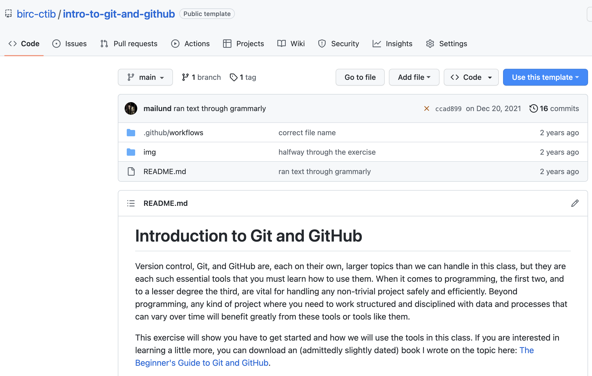

# Week 1 — Read-mapping and file formats

## Lecture

- Topics: Introduction to this class, to GitHub, and to the UNIX command line.
- Slides: [Introduction to CTiB](../slides/Week%2001%20-%20Introduction%20to%20CTiB.pdf)
- Reading material: ICT (Introduction to Computational Thinking) Chapter 1.

## Exercises

### Introduction to Git and GitHub

Version control, Git, and GitHub are, each on their own, larger topics than we can handle in this class, but they are each such essential tools that you must learn how to use them. When it comes to programming, the first two, and to a lesser degree the third, are vital for handling any non-trivial project safely and efficiently. Beyond programming, any kind of project where you need to work structured and disciplined with data and processes that can vary over time will benefit greatly from these tools or tools like them.

This exercise will show you have to get started and how we will use the tools in this class. If you are interested in learning a little more, you can download an (admittedly slightly dated) book T. Mailund wrote on the topic here: [The Beginner's Guide to Git and GitHub](https://www.dropbox.com/s/1d086uef0fpehbj/Git-and-GitHub.pdf?dl=0).

#### Getting assignment repositories

In version control systems, "repositories" essentially refer to directories with something like "track changes" enabled. Different systems differ on how this is implemented, but it reasonably accurately describes how the Git system works. If you have a Git repository, you have a directory (including its subdirectories) where you can make changes. Git will track them, such that you can go back and see what the project looked like in the past, compare the transitions between different versions, revert to older versions if you need to, and much more.

Also, the standard for version control systems, at least for the last 20-30 years, is that they have a distributed nature, where versions of your project can live in the cloud and be accessed by multiple collaborators. Each collaborator has his or her own local repository, where they can make changes that are not visible to others. These local repositories know about one or more repositories that sit in the cloud, where they can push local changes to make them visible to the world, or from where they can pull down changes others have made.

GitHub handles this cloud-like behaviour for us, storing a repository in the cloud and connecting our local repositories to it, so it is not something we need to worry about in day-to-day life. We can just work in our repository, push changes when we want to, and pull down our collaborators' changes when they have made them.

To use GitHub, you need an account there. It is free; you just need to sign up, so if you haven't got an account already, go to [https://github.com](https://github.com) and follow the instructions for signing up.

We need to get a repository to work with for the next step. In this class each assignment has a matching repository that you can use as template for completing the assignment.

The one available for this exercise is this: [Introduction to Git and GitHub][https://github.com/birc-ctib/intro-to-git-and-github]. Click it, and then read on for further instructions.

If you are on GitHub, following the link you got, there is the name of the repositiory at the top, below that there is a tool-bar (Code, Issues, Pull requests, Actions, ...), and below that four buttons. The only button that is interesting for us is the blue "Use this template" one.

Click on that.



There are three ways you can download the repository: you can "clone" it, open it with GitHub Desktop, or download a zip file. The last option is of no use to us because we will only get a copy of the code, and we want a repository we can work with. We can choose the first option if the command-line git tools are installed. Then you copy the URL, and in your terminal, you write

```bash
> git clone https://github.com/[REPO-NAME]
```

The second option lets you open and manage the repository with a GUI tool, [GitHub Desktop](https://desktop.github.com). If you are not familiar with working on the command line, this is a good choice, and it is an excellent tool for the kind of work we will be doing.

In any case, whether you got the code using VS Code, GitHub Desktop, or you cloned the repository using the command line, you should now have a copy of the repository on your own machine.

Continue this exercise on the repository you just created. There is more to cover, but you will see the instructions there, and it is in that repository you can try out working with Git and GitHub.

### Introducing the command line

When you are familiar with Git and GitHub, you [should also familiarise yourself with the UNIX command line][command-line-ex].


[command-line-ex]: https://classroom.github.com/a/1PL6fkvZ
[intro-to-github-ex]: https://classroom.github.com/a/thiv-vBR

[w02-prog-ex]: https://classroom.github.com/a/eHT3v0vO
[w02-commandline-ex]: https://classroom.github.com/a/RZ5qj9EM

[w03-merge-ex]: https://classroom.github.com/a/UmJIjYga
[w03-guessing-ex]: https://classroom.github.com/a/w2zYG9rs
[w03-base-ex]: https://classroom.github.com/a/WhkMKxiG
[w03-sieve-ex]: https://classroom.github.com/a/nOlUcLpC
[w03-substring-ex]: https://classroom.github.com/a/g5izmEF6
[w03-powerset-ex]: https://classroom.github.com/a/fFQ8bnRW
[w03-subseq-ex]: https://classroom.github.com/a/o_x993_l

[w05-bucket-ex]: https://classroom.github.com/a/FRyhSo9Z

[w06-simple-funcs-ex]: https://classroom.github.com/a/HSJme2Sc
[w06-kmers-ex]: https://classroom.github.com/a/SCdCrWls
[w06-reduce-ex]: https://classroom.github.com/a/S3nNXf4P

[w07-lists-ex]: https://classroom.github.com/a/h7IbTip7

[w09-mm-ex]: https://classroom.github.com/a/xeQimhib

[w11-sllists-ex]: https://classroom.github.com/a/_pQk3Ubu
[w11-dllists-ex]: https://classroom.github.com/a/7pl86e-u

[w12-list-set-ex]: https://classroom.github.com/a/XkIwH_-C
[w12-search-tree-set-ex]: https://classroom.github.com/a/k7PcLVzX
[w12-hash-table-ex]: https://classroom.github.com/a/fyiPM3Q1

[w13-linked-list-stack-ex]: https://classroom.github.com/a/ilT9Ac44
[w13-newick-ex]: https://classroom.github.com/a/YAEwZvKz
[w13-dllist-queue-ex]: https://classroom.github.com/a/C8WQ7Izm

[w14-huffmann-ex]: https://classroom.github.com/a/M8XtDVVs
[w14-prim-ex]: https://classroom.github.com/a/Sx68X7e-
[w14-search-tree-pqueue-ex]: https://classroom.github.com/a/9_jZrklZ
[w14-leftist-heap-ex]: https://classroom.github.com/a/k-N11ODB
[w14-binary-heap-ex]: https://classroom.github.com/a/sjuKt9Lb
[w14-heap-sort-ex]: https://classroom.github.com/a/OpTr0gTe


